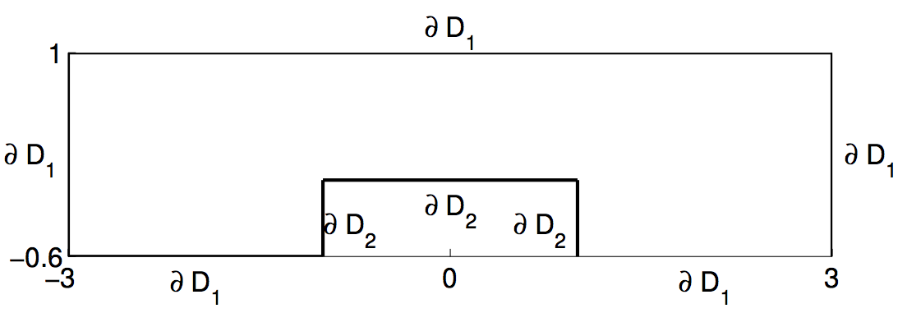

# Solving a parabolic PDE with random input data with MATLAB

## What does this MATLAB project show?

This MATLAB project shows one possible way of solving a partial differential equation (PDE) with random parameters. The discretization in space and time is done with **triangular finite elements** and a **MATLAB ODE solver** for stiff problems, respectively. The random part is discretized by means of an interpolation with adaptive, anisotropic placement of nodes on a **sparse grid**.

To minimize the interpolating nodes is especially important, because each node means solving a deterministic PDE, which is computationally demanding in many cases. Although the task is very well parallelizable, one needs to break the **curse of dimensionality**.

The notebook contains sections about the following topics:

* **Deterministic preprocessing**: mesh and ODE settings
* **Random preprocessing**: parametrization of a random field
* Settings and running of anisotropic adaptive **stochastic collocation**
* **Deterministic postprocessing**: space and time integration or evaluation in fixed points
* **Random postprocessing**: getting the mean, variance, and density of the numerical results

## Problem description

The problem describes the heat conduction in an electronic chip with uncertain heat conductivity, modeled as a random field, discretized by means of a truncated Karhunen-Loève expansion with 3 uniformly distributed random variables. The figure shows the two-dimensional spatial domain D of the chip. At the cavity a heat flux into the domain is assumed; the remaining boundary is assumed to be adiabatic and the initial temperature is set to 0. The governing equation is the unsteady heat equation subject to the boundary conditions just described, and time running from 0 to 1. Adaptive anisotropic stochastic collocation on a sparse grid is applied to discretize the random space efficiently.

## How to use the model & explanation of all files

* Either run the notebook step by step or run the MATLAB script *main.m*.
* When the notebook or script are run a new folder is created: *problemfolder/solutions*. By default problemfolder is the current directory. All solutions are saved as *mat* files.
* There are many additional functions called from the notebook or the script. These are stored in the *functions* folder

There are some computationally demanding steps involved. One is the random preprocessing and the other are the deterministic solutions for all collocation points. 

* For the parameter *refinementlevel* equal to 3 and the correlation length *L* equal to 4 the corresponding data for the Karhunen-Loève expansion is stored in *eigInfoL4refine3.mat*. Its important to note that running the script without these precomputed data may take a lot of RAM. 
* The spatial mesh is stored in a special text format *finiteElementMesh.geo*.

## Additional note

The simulation runs on Linux and Mac systems, but not on a Windows system. For that some changes regarding file paths and system commands would be necessary.

For an improved view please use the following nbviewer URL:

https://nbviewer.jupyter.org/github/bschieche/MATLAB-random-PDE/blob/master/stochastic-collocation-heat-equation.ipynb

